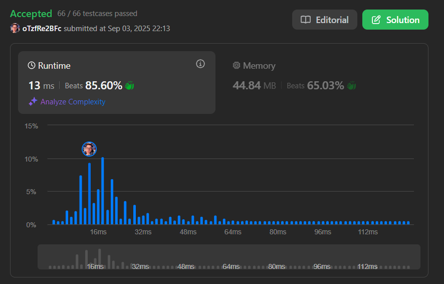

# Exercício 1: Minimum Number of Vertices to Reach All Nodes (Médio)

Este diretório contém a solução para o primeiro exercício da disciplina de Grafos 1, baseado em um problema do LeetCode.

## Descrição
O objetivo do exercício é encontrar o número mínimo de vértices necessários para alcançar todos os nós de um grafo direcionado. A solução foi implementada em Python no arquivo `MinumumNumberofVertices.py`.

## Enunciado

[Link do Exercício](https://leetcode.com/problems/minimum-number-of-vertices-to-reach-all-nodes)

Dado um grafo direcionado com n vértices numerados de 0 a n-1 e uma lista de arestas edges onde cada aresta é representada por um par de inteiros [from, to], você deve encontrar o menor conjunto de vértices a partir do qual todos os outros vértices são alcançáveis.

Observações:

- É garantido que existe uma solução única.
- O grafo pode conter ciclos.

✅ Exemplo

**Entrada:**

```
n = 6
edges = [[0,1], [0,2], [2,5], [3,4], [4,2]]
```


**Saída:**

```
[0, 3]
```

**Explicação:**

- O vértice 0 pode alcançar os vértices 0, 1, 2 e 5.
- O vértice 3 pode alcançar os vértices 3, 4 e 2.
- Portanto, os vértices 0 e 3 são suficientes para alcançar todos os outros vértices.

## Status da Resolução
